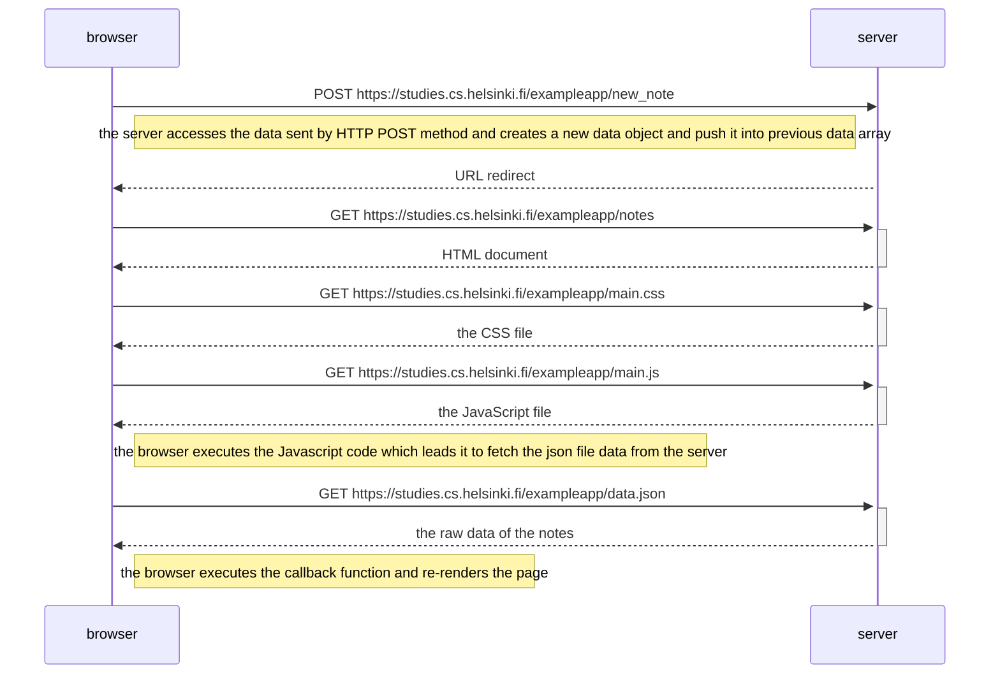

```mermaid
sequenceDiagram
 participant browser
 participant server

 browser ->> server: POST https://studies.cs.helsinki.fi/exampleapp/new_note
 activate server
 Note left of server: the server accesses the data sent by HTTP POST method and creates a new data object and push it into previous data array
 server -->> browser: URL redirect
 browser ->> server: GET  https://studies.cs.helsinki.fi/exampleapp/notes
 activate server
 server -->> browser: HTML document
 deactivate server
 browser ->> server: GET https://studies.cs.helsinki.fi/exampleapp/main.css
 activate server
 server -->> browser: the CSS file
 deactivate server
 browser ->> server: GET  https://studies.cs.helsinki.fi/exampleapp/main.js
 activate server
 server -->> browser:  the JavaScript file
 deactivate server
 Note right of browser: the browser executes the Javascript code which leads it to fetch the json file data from the server
 browser ->> server: GET https://studies.cs.helsinki.fi/exampleapp/data.json
 activate server
 server -->> browser:the raw data of the notes
 deactivate server
 Note right of browser: the browser executes the callback function and re-renders the page

```
