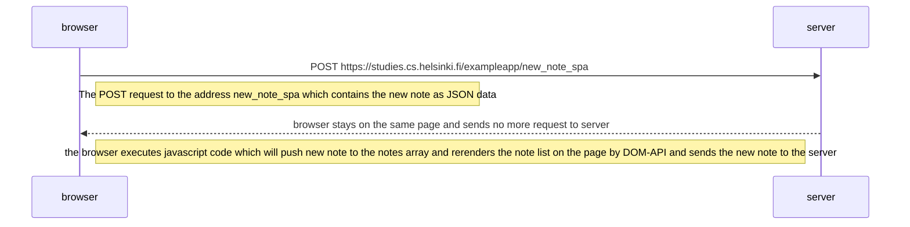

```mermaid
sequenceDiagram
 participant browser
 participant server
 browser ->> server: POST https://studies.cs.helsinki.fi/exampleapp/new_note_spa
 Note right of browser:The POST request to the address new_note_spa which contains the new note as JSON data
 server -->> browser: browser stays on the same page and sends no more request to server
 Note right of browser:the browser executes javascript code which will push new note to the notes array and rerenders the note list on the page by DOM-API and sends the new note to the server
```
